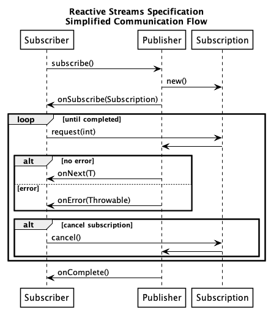

= Java Meetup
:source-highlighter: highlightjs
// :revealjs_plugin_pdf: enabled
:revealjs_theme: simple
:highlightjs-theme: https://cdnjs.cloudflare.com/ajax/libs/highlight.js/9.15.10/styles/googlecode.min.css

[subs="attributes"]
++++

++++

== Future in Java 8

=== !
// Future

[.stretch]
[source,java]
----
include::../java/de/meetup/CompletableFuture8.java[tags=future80]
----

=== !
// Future

[.stretch]
[source,java]
----
include::../java/de/meetup/CompletableFuture8.java[tags=future81]
----

[transition=zoom, %notitle]
== Reactive Streams Specification

